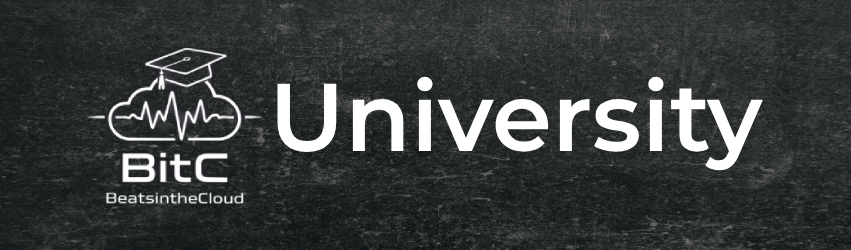

  

  # BitC University
  ### *BeatsintheCloud University*
  
  **The Open-Source "Shield Strategy" Degree Roadmap**

  
  
  

  **Hack the debt. Build the shield. Get hired.**

---

## Goal & Mission Statement

### The Problem
U.S. Higher Education is out of control. The current system demands that you take on insurmountable debt just to meet the "minimum requirement" of a Bachelor’s degree. For most, this means spending four years and $40,000+ on theoretical lectures, only to find that HR still won't interview you because you lack professional certifications. You are left with a piece of paper, no job-ready skills, and a monthly bill you can't afford.

### The Mission
**BITC University** exists to break that cycle. Our mission is to provide a radical, open-source roadmap for the "Shield Strategy"—a method of education that prioritizes technical competence and financial freedom over institutional prestige.

We aim to dismantle the barrier to entry for high-paying tech and management careers by showing students how to:
1. **Hack the Cost:** Use the "aggregated credit" model to earn a nationally accredited degree for under $2000, with professional credentials to make you job-ready once you receive your diploma.
2. **Build the Shield:** Earn industry-standard certifications (Google, Cisco, Microsoft) that force recruiters to take you seriously.
3. **Finish Fast:** Execute a high-density, 9-month roadmap that respects your time and your intelligence.

### The Goal
Our goal is to provide a standardized, community-driven curriculum that bypasses the predatory tuition model. We don't care about "college life" or sports teams; we care about your ROI. By the time you graduate through this path, you won't just have an accredited degree to get past the HR filters—you'll have the professional badges that prove you can actually do the work.

**Stop overpaying for a seat in a classroom. Start building your career.**

  

### But Why Newlane University?

Newlane University offers a different path to an accredited liberal arts degree. They’ve swapped traditional semesters for a **competency-based model**. This means you don't sit through lectures; you simply prove you know the material. Once you pass their three-phase assessment, you move on.

**The Financial Advantage:**
The cost is the most striking part. You pay **$1,500 total** for an Associate’s or Bachelor’s degree. It starts with $249 upfront and $39 a month until you hit that cap. If you need more time after paying the full amount, you keep your access for free until you graduate.

**Built for the "Shield Strategy":**
* **Massive Transfer Capacity:** You can transfer up to **75% of your degree** from previous schools or ACE-recommended exams (like the ones in this repo).
* **Zero Hurdles:** There are no admissions hurdles or fixed schedules. You start immediately.
* **Ultimate Control:** They provide the framework and the accreditation while you control the pace.

> "Essentially, they provide the accreditation while you control the pace."

# The "Shield Strategy" Degree Plan
**University:** Newlane University (via Aggregated Transfer Credits)  
**Goal:** 9-Month completion | <$2000 Total Cost | Job-Ready Certifications

## The Strategy
This repository contains 7 distinct "tracks" designed to maximize transfer credits while ensuring professional viability. 

* **The Degree:** A nationally accredited Bachelor's degree (via Newlane University).
* **The Shield:** Industry-recognized certifications (Google, Microsoft, Cisco) that validate hard skills to employers who might look down on competency-based degrees.
* **The Cost:** Optimized by using "Free-to-Cheap" credit sources (Modern States, Saylor Academy) for all non-specialty coursework.

## The Universal Liberal Arts Core (15 Credits)
*Required for ALL tracks. Completed via Modern States (Free).*

| Course Name | Provider | Credits | Cost | Notes |
| :--- | :--- | :--- | :--- | :--- |
| College Composition | Modern States (CLEP) | 3 | $0 | Free voucher from Modern States |
| College Mathematics | Modern States (CLEP) | 3 | $0 | Free voucher from Modern States |
| Humanities | Modern States (CLEP) | 3 | $0 | Free voucher from Modern States |
| Introductory Sociology | Modern States (CLEP) | 3 | $0 | Free voucher from Modern States |
| History of the United States I | Modern States (CLEP) | 3 | $0 | Free voucher from Modern States |

## The Tracks
1.  **[Cybersecurity](tracks/cybersecurity.md):** Operations, Defense, and Compliance.
2.  **[Artificial Intelligence](tracks/ai_engineering.md):** Engineering, Math, and Model Deployment.
3.  **[Cloud & DevOps](tracks/cloud_devops.md):** Multi-cloud Infrastructure and CI/CD.
4.  **[Network Management](tracks/network_mgmt.md):** Hardware, Connectivity, and Infrastructure.
5.  **[Software Development](tracks/software_dev.md):** Full Stack Engineering (Frontend + Backend).
6.  **[Data Science](tracks/data_science.md):** Analytics, Statistics, and Modeling.
7.  **[Project Management](tracks/project_mgmt.md):** Agile, Scrum, and Product Leadership.

# Contributing to BITC University

First off, thanks for taking an interest in helping others hack their education. This project stays alive because the community finds new credit shortcuts and identifies when old ones stop working.

## How You Can Help

### 1. Update Course Info
If a provider (Saylor, Coursera, etc.) changes their ACE credit recommendation or a course is discontinued, please open an Issue or a Pull Request immediately.

### 2. Suggest New Tracks
Found a way to do a specialized degree in a field we haven't covered? Draft a new `.md` file in the `tracks/` folder and submit it.

### 3. Cost Optimization
If you find a cheaper way to earn a specific credit (e.g., a new free voucher program or a cheaper proctoring service), let us know.

## Contribution Guidelines

* **Keep it Direct:** No fluff. Use the existing table formats.
* **Verify Credits:** Ensure any course you suggest carries an active **ACE Credit Recommendation**. We don't want students taking courses that won't transfer.
* **Diversify:** Prefer "The Shield Strategy"—mixing academic theory with industry-recognized certifications.

## Pull Request Process

1. Fork the repo.
2. Create your feature branch (`git checkout -b feature/NewTrack`).
3. Commit your changes.
4. Push to the branch.
5. Open a Pull Request with a brief explanation of why the change is beneficial.

Attribution-ShareAlike 4.0 International

=======================================================================

Creative Commons Corporation ("Creative Commons") is not a law firm and
does not provide legal services or legal advice. Distribution of
Creative Commons public licenses does not create a lawyer-client or
other relationship. Creative Commons makes its licenses and related
information available on an "as-is" basis. Creative Commons gives no
warranties regarding its licenses, any material licensed under their
terms and conditions, or any related information. Creative Commons
disclaims all liability for damages resulting from their use to the
fullest extent possible.

Using Creative Commons Public Licenses

Creative Commons public licenses provide a standard set of terms and
conditions that creators and other rights holders may use to share
original works of authorship and other material subject to copyright
and certain other rights. The following considerations are for
informational purposes only, are not exhaustive, and do not form part
of our licenses.

     Considerations for licensors: Our public licenses are
     intended for use by those authorized to give the public
     permission to use material in ways otherwise restricted by
     copyright and certain other rights. Our licenses are
     irrevocable. Licensors should read and understand the terms
     and conditions of the license they choose before applying it.
     Licensors should also secure all rights necessary before
     applying our licenses so that the public can reuse the
     material as expected. Licensors should clearly mark any
     material not subject to the license. This includes other
     material, or material used under an exception or limitation
     to copyright.

     Considerations for the public: By using one of our public
     licenses, a licensor grants the public permission to use the
     licensed material under specified terms and conditions. If
     the licensor's permission is not necessary for any reason--for
     example, because of any applicable exception or limitation to
     copyright--then that use is not regulated by the license.
     Our licenses grant only permissions under copyright and
     certain other rights that a licensor has authority to grant.
     Use of the licensed material may still be restricted for
     other reasons, including because others have copyright or
     other rights in the material. A licensor may make special
     requests, such as asking that all changes be marked or
     described. Although not required by our licenses, you are
     encouraged to respect those requests where reasonable.

=======================================================================

Creative Commons Attribution-ShareAlike 4.0 International Public License

By exercising the Licensed Rights (defined below), You accept and agree
to be bound by the terms and conditions of this Creative Commons
Attribution-ShareAlike 4.0 International Public License ("Public
License"). To the extent this Public License may be interpreted as a
contract, You are granted the Licensed Rights in consideration of Your
acceptance of these terms and conditions, and the Licensor grants You
such rights in consideration of benefits the Licensor receives from
making the Licensed Material available under these terms and
conditions.

Section 1 -- Definitions.

  a. Adapted Material means material subject to Copyright and Similar
     Rights that is derived from or based upon the Licensed Material
     and in which the Licensed Material is translated, altered,
     arranged, transformed, or otherwise modified in a manner requiring
     permission under the Copyright and Similar Rights held by the
     Licensor. For purposes of this Public License, where the Licensed
     Material is a musical work, performance, or sound recording,
     Adapted Material is always produced where the Licensed Material is
     synched in timed relation with a moving image.

  b. Adapter's License means the license You apply to Your Copyright
     and Similar Rights in Your contributions to Adapted Material in
     accordance with the terms and conditions of this Public License.

  c. BY-SA Compatible License means a license listed at
     creativecommons.org/compatiblelicenses, approved by Creative
     Commons as essentially the equivalent of this Public License.

  d. Copyright and Similar Rights means copyright and/or similar rights
     closely related to copyright including, without limitation,
     performance, broadcast, sound recording, and Sui Generis Database
     Rights, without regard to how the rights are labeled or
     categorized. For purposes of this Public License, the rights
     specified in Section 2(b)(1)-(2) are not Copyright and Similar
     Rights.

  e. Effective Technological Measures means those measures that, in the
     absence of proper authority, may not be circumvented under laws
     fulfilling obligations under Article 11 of the WIPO Copyright
     Treaty adopted on December 20, 1996, and/or similar international
     agreements.

  f. Exceptions and Limitations means fair use, fair dealing, and/or
     any other exception or limitation to Copyright and Similar Rights
     that applies to Your use of the Licensed Material.

  g. Licensed Material means the artistic or literary work, database,
     or other material to which the Licensor applied this Public
     License.

  h. Licensed Rights means the rights granted to You subject to the
     terms and conditions of this Public License, which are limited to
     all Copyright and Similar Rights that apply to Your use of the
     Licensed Material and that the Licensor has authority to license.

  i. Licensor means the individual(s) or entity(ies) granting rights
     under this Public License.

  j. Share means to provide material to the public by any means or
     process that requires permission under the Licensed Rights, such
     as reproduction, public display, public performance, distribution,
     dissemination, communication, or importation, and to make material
     available to the public including in ways that members of the
     public may access the material from a place and at a time
     individually chosen by them.

  k. Sui Generis Database Rights means rights other than copyright
     resulting from Directive 96/9/EC of the European Parliament and of
     the Council of 11 March 1996 on the legal protection of databases,
     as amended and/or succeeded, as well as other essentially
     equivalent rights anywhere in the world.

  l. You means the individual or entity exercising the Licensed Rights
     under this Public License. Your has a corresponding meaning.

Section 2 -- Scope.

  a. License grant.

       1. Subject to the terms and conditions of this Public License,
          the Licensor hereby grants You a worldwide, royalty-free,
          non-sublicensable, non-exclusive, irrevocable license to
          exercise the Licensed Rights in the Licensed Material to:

            A. reproduce and Share the Licensed Material, in whole or
               in part; and

            B. produce, reproduce, and Share Adapted Material.

       2. Exceptions and Limitations. For the avoidance of doubt, where
          Exceptions and Limitations apply to Your use, this Public
          License does not apply, and You do not need to comply with
          its terms and conditions.

       3. Term. The term of this Public License is specified in Section
          6(a).

       4. Media and formats; technical modifications allowed. The
          Licensor authorizes You to exercise the Licensed Rights in
          all media and formats whether now known or hereafter created,
          and to make technical modifications necessary to do so. The
          Licensor waives and/or agrees not to assert any right or
          authority to forbid You from making technical modifications
          necessary to exercise the Licensed Rights, including
          technical modifications necessary to circumvent Effective
          Technological Measures. For purposes of this Public License,
          simply making modifications authorized by this Section 2(a)
          (4) never produces Adapted Material.

       5. Downstream recipients.

            A. Offer from the Licensor -- Licensed Material. Every
               recipient of the Licensed Material automatically
               receives an offer from the Licensor to exercise the
               Licensed Rights under the terms and conditions of this
               Public License.

            B. Additional offer from the Licensor -- Adapted Material.
               Every recipient of Adapted Material from You
               automatically receives an offer from the Licensor to
               exercise the Licensed Rights in the Adapted Material
               under the conditions of the Adapter's License You apply.

            C. No downstream restrictions. You may not offer or impose
               any additional or different terms or conditions on, or
               apply any Effective Technological Measures to, the
               Licensed Material if doing so restricts exercise of the
               Licensed Rights by any recipient of the Licensed
               Material.

       6. No endorsement. Nothing in this Public License constitutes or
          may be construed as permission to assert or imply that You
          are, or that Your use of the Licensed Material is, connected
          with, or sponsored, endorsed, or granted official status by,
          the Licensor or others designated to receive attribution as
          provided in Section 3(a)(1)(A)(i).

  b. Other rights.

       1. Moral rights, such as the right of integrity, are not
          licensed under this Public License, nor are publicity,
          privacy, and/or other similar personality rights; however, to
          the extent possible, the Licensor waives and/or agrees not to
          assert any such rights held by the Licensor to the limited
          extent necessary to allow You to exercise the Licensed
          Rights, but not otherwise.

       2. Patent and trademark rights are not licensed under this
          Public License.

       3. To the extent possible, the Licensor waives any right to
          collect royalties from You for the exercise of the Licensed
          Rights, whether directly or through a collecting society
          under any voluntary or waivable statutory or compulsory
          licensing scheme. In all other cases the Licensor expressly
          reserves any right to collect such royalties.

Section 3 -- License Conditions.

Your exercise of the Licensed Rights is expressly made subject to the
following conditions.

  a. Attribution.

       1. If You Share the Licensed Material (including in modified
          form), You must:

            A. retain the following if it is supplied by the Licensor
               with the Licensed Material:

                 i. identification of the creator(s) of the Licensed
                    Material and any others designated to receive
                    attribution, in any reasonable manner requested by
                    the Licensor (including by pseudonym if
                    designated);

                ii. a copyright notice;

               iii. a notice that refers to this Public License;

                iv. a notice that refers to the disclaimer of
                    warranties;

                 v. a URI or hyperlink to the Licensed Material to the
                    extent reasonably practicable;

            B. indicate if You modified the Licensed Material and
               retain an indication of any previous modifications; and

            C. indicate the Licensed Material is licensed under this
               Public License, and include the text of, or the URI or
               hyperlink to, this Public License.

       2. You may satisfy the conditions in Section 3(a)(1) in any
          reasonable manner based on the medium, means, and context in
          which You Share the Licensed Material. For example, it may be
          reasonable to satisfy the conditions by providing a URI or
          hyperlink to a resource that includes the required
          information.

       3. If requested by the Licensor, You must remove any of the
          information required by Section 3(a)(1)(A) to the extent
          reasonably practicable.

  b. ShareAlike.

     In addition to the conditions in Section 3(a), if You Share
     Adapted Material You produce, the following conditions also apply.

       1. The Adapter's License You apply must be a Creative Commons
          license with the same License Elements, this version or
          later, or a BY-SA Compatible License.

       2. You must include the text of, or the URI or hyperlink to, the
          Adapter's License You apply. You may satisfy this condition
          in any reasonable manner based on the medium, means, and
          context in which You Share Adapted Material.

       3. You may not offer or impose any additional or different terms
          or conditions on, or apply any Effective Technological
          Measures to, Adapted Material that restrict exercise of the
          rights granted under the Adapter's License You apply.

Section 4 -- Sui Generis Database Rights.

Where the Licensed Rights include Sui Generis Database Rights that
apply to Your use of the Licensed Material:

  a. for the avoidance of doubt, Section 2(a)(1) grants You the right
     to extract, reuse, reproduce, and Share all or a substantial
     portion of the contents of the database;

  b. if You include all or a substantial portion of the database
     contents in a database in which You have Sui Generis Database
     Rights, then the database in which You have Sui Generis Database
     Rights (but not its individual contents) is Adapted Material,
     including for purposes of Section 3(b); and

  c. You must comply with the conditions in Section 3(a) if You Share
     all or a substantial portion of the contents of the database.

For the avoidance of doubt, this Section 4 supplements and does not
replace Your obligations under this Public License where the Licensed
Rights include other Copyright and Similar Rights.

Section 5 -- Disclaimer of Warranties and Limitation of Liability.

  a. UNLESS OTHERWISE SEPARATELY UNDERTAKEN BY THE LICENSOR, TO THE
     EXTENT POSSIBLE, THE LICENSOR OFFERS THE LICENSED MATERIAL AS-IS
     AND AS-AVAILABLE, AND MAKES NO REPRESENTATIONS OR WARRANTIES OF
     ANY KIND CONCERNING THE LICENSED MATERIAL, WHETHER EXPRESS,
     IMPLIED, STATUTORY, OR OTHER. THIS INCLUDES, WITHOUT LIMITATION,
     WARRANTIES OF TITLE, MERCHANTABILITY, FITNESS FOR A PARTICULAR
     PURPOSE, NON-INFRINGEMENT, ABSENCE OF LATENT OR OTHER DEFECTS,
     ACCURACY, OR THE PRESENCE OR ABSENCE OF ERRORS, WHETHER OR NOT
     KNOWN OR DISCOVERABLE. WHERE DISCLAIMERS OF WARRANTIES ARE NOT
     ALLOWED IN FULL OR IN PART, THIS DISCLAIMER MAY NOT APPLY TO YOU.

  b. TO THE EXTENT POSSIBLE, IN NO EVENT WILL THE LICENSOR BE LIABLE
     TO YOU ON ANY LEGAL THEORY (INCLUDING, WITHOUT LIMITATION,
     NEGLIGENCE) OR OTHERWISE FOR ANY DIRECT, SPECIAL, INDIRECT,
     INCIDENTAL, CONSEQUENTIAL, PUNITIVE, EXEMPLARY, OR OTHER LOSSES,
     COSTS, EXPENSES, OR DAMAGES ARISING OUT OF THIS PUBLIC LICENSE OR
     USE OF THE LICENSED MATERIAL, EVEN IF THE LICENSOR HAS BEEN
     ADVISED OF THE POSSIBILITY OF SUCH LOSSES, COSTS, EXPENSES, OR
     DAMAGES. WHERE A LIMITATION OF LIABILITY IS NOT ALLOWED IN FULL OR
     IN PART, THIS LIMITATION MAY NOT APPLY TO YOU.

  c. The disclaimer of warranties and limitation of liability provided
     above shall be interpreted in a manner that, to the extent
     possible, most closely approximates an absolute disclaimer and
     waiver of all liability.

Section 6 -- Term and Termination.

  a. This Public License applies

## Disclaimer

**Legal Notice & Affiliation**

This repository, **BITC University**, is an independent educational research project and is provided for informational purposes only.

* **No Affiliation:** I am in no way affiliated with, endorsed by, or partnered with **Newlane University**, Modern States, Saylor Academy, Coursera, Google, Microsoft, Cisco, or IBM. All trademarks, service marks, and company names are the property of their respective owners.
* **Transfer Policy:** Transfer credit acceptance is determined solely by Newlane University. Policies, residency requirements, and transfer caps can change at any time. You are responsible for verifying with the Newlane registrar that these specific ACE-recommended credits satisfy current degree requirements before committing time or money.
* **No Guarantee of Results:** Following these tracks does not guarantee admission to any university, the awarding of a degree, or employment. 
* **Financial & Technical Risk:** I am not responsible for failed exams, changes in subscription pricing, or financial loss. All cost estimates are based on 2025 market rates and are subject to change.

**Use this roadmap at your own risk. Perform your own due diligence.**
