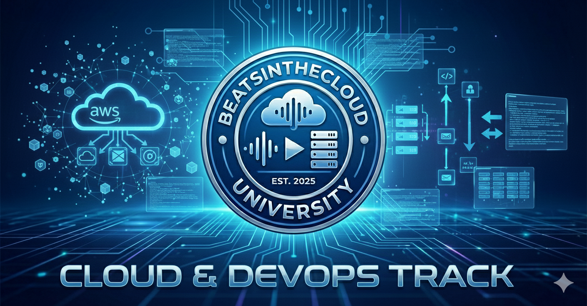

  

# Track: Cloud & DevOps

**Focus:** Infrastructure as Code, CI/CD, Multi-Cloud  
**Est. Cost:** $337  
**Time to Complete:** ~9 Months

**Target Degree:** B.A. in Liberal Arts, Specialization in Business Administration

**Why:** DevOps is about "Operations." The Strategic IT and Ops Management courses in this track align directly with the Business Administration competency model.

---

## Specialty Core (39 Credits)

*Strategy: Validate on Azure (Enterprise) and Google (Startup/Tech).*

| Course / Certification | Provider | Est. Cost | Credits | Role |
|------------------------|----------|-----------|---------|------|
| BUS303: Strategic IT | Saylor | $5 | 3 | Cloud Strategy/Costs |
| IBM DevOps & Engineering | IBM (Coursera) | ~$49 | 18 | CI/CD, Kubernetes, Docker |
| IBM Full Stack Cloud Development | IBM (Coursera) | ~$49 | 18 | Advanced Cloud Concepts|

---

## Recommended Electives (15 Credits)

| Course Name | Provider | Cost | Credits | Relevance |
|-------------|----------|------|---------|-----------|
| BUS206: Mgmt Info Systems | Saylor | $5 | 3 | Systems Admin |
| Azure Administrator (AZ-104) | Microsoft (Exam) | $165 | 3 | **Cert #1:** Cloud Admin Gold Standard |
| Google Cloud Engineering | Google (Coursera) | ~$49 | 6 | **Cert #2:** GCP Infrastructure |
| CS402: Computer Comms | Saylor | $5 | 3 | Networking foundation |

---

## 9-Month Roadmap

| Month | Focus |
|-------|-------|
| Month 1 | Google Cloud Engineering (Coursera) |
| Month 2-3 | IBM DevOps (Coursera) |
| Month 4 | CS402 (Networking) & MIS |
| Month 5 | Strategic IT & Ops Management |
| Month 6 | Project Management |
| Month 7-8 | Azure AZ-104 Study & Exam |
| Month 9 | Clean up Electives |

---

[← Back to All Tracks](../README.md#the-tracks)
