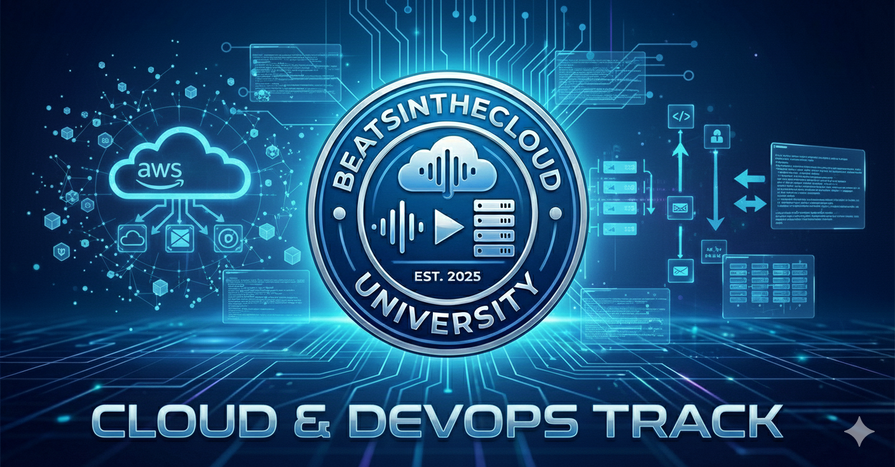

  

# Track: Cloud & DevOps

**Focus:** Infrastructure as Code, CI/CD, Multi-Cloud  
**Est. Cost:** $337  
**Time to Complete:** ~9 Months

**Target Degree:** B.A. in Liberal Arts, Specialization in Business Administration

**Why:** DevOps is about "Operations." The Strategic IT and Ops Management courses in this track align directly with the Business Administration competency model.

---

## Specialty Core (39 Credits)

*Strategy: Understand DevOps culture and cloud native architecture.*

| Course / Certification | Provider | Est. Cost | Credits | Role |
|------------------------|----------|-----------|---------|------|
| BUS303: Strategic IT | Saylor | $5 | 3 | Cloud Strategy/Costs |
| IBM DevOps & Engineering | IBM (Coursera) | ~$49 | 18 | CI/CD, Kubernetes, Docker |
| IBM Full Stack Cloud Development | IBM (Coursera) | ~$49 | 18 | Advanced Cloud Concepts|

---

## Recommended Electives (15 Credits)

| Course Name | Provider | Cost | Credits | Relevance |
|-------------|----------|------|---------|-----------|
| BUS206: Mgmt Info Systems | Saylor | $5 | 3 | Systems Admin |
| Azure Administrator (AZ-104) | Microsoft (Exam) | $165 | 3 | **Cert #1:** Cloud Admin Gold Standard |
| Google Cloud Engineering | Google (Coursera) | ~$49 | 6 | **Cert #2:** GCP Infrastructure |
| CS402: Computer Comms | Saylor | $5 | 3 | Networking foundation |

---

# Capstone Certification

> **Note:** Capstone certifications are generally **not ACE credit eligible** and do not transfer as college credit. They are included as career-focused credentials that **build your "Shield"**—backing up your academic credentials with industry-recognized proof of technical competence that employers trust.
---
### Recommended Capstone: AWS Solutions Architect Associate

| | |
|---|---|
| **Provider** | Amazon Web Services |
| **Cost** | $150 |
| **ACE Credit** | Possible - 3|

**Why this certification?**

AWS Solutions Architect Associate is the gold standard for cloud roles. It's the most requested cloud certification in job postings worldwide. Your IBM DevOps & Engineering and Full Stack Cloud Development coursework provides approximately 60% coverage of exam topics. This cert proves you can design and deploy scalable systems on the dominant cloud platform. **This is your Shield**—validating that your degree comes with real architectural skills.

### Recommended Association

| | |
|---|---|
| **Organization** | CNCF (Cloud Native Computing Foundation) — Community Contributor |
| **Cost** | **FREE** |
| **Website** | [cncf.io](https://www.cncf.io/) |

**Why join?** Contribute to open-source cloud-native projects (Kubernetes, Prometheus, etc.). No formal membership required—just start contributing on GitHub. Lists contributions on your profile and builds real credibility in the DevOps community.

---

Go Further. Pursue a Masters Degree at a fraction of the cost of traditional school. Save more money and time if you can speak spanish

## Cloud & DevOps Track

| School | Program | Target Cost | High End Cost | Accreditation | NACES Eval? | Note |
|--------|---------|-------------|---------------|---------------|-------------|------|
| UNIA (Universidad Internacional de Andalucía) | Master in Digital Transformation | $1,500 | $3,000 | Spanish Public University - Official Master | Yes - WES or ECE | Business digital strategy; Spanish language |
| UNED (Universidad Nacional de Educación a Distancia) | Master in Systems & Control Engineering | €1,200 | €2,500 | Spanish Public University - Official Master | Yes - WES or ECE | Systems engineering; Spanish language |
| Western Governors University | MS in DevOps Engineering, Software Engineering | $4,385 | $8,770 | NWCCU (US Regional) + NSA/DHS CAE-CD | No - US Regionally Accredited | Concentration for Software Engineering Program |
| Western Governors University | MS in Computer Science | $3,985 | $7,970 | NWCCU (US Regional) | No - US Regionally Accredited | AI, algorithms, systems focus |
| UNED | Master in Connected Industry | €1,200 | €2,500 | Spanish Public University - Official Master | Yes - WES or ECE | Spanish language; Industry 4.0/IoT focus |

---

[← Back to All Tracks](../README.md#the-tracks)
