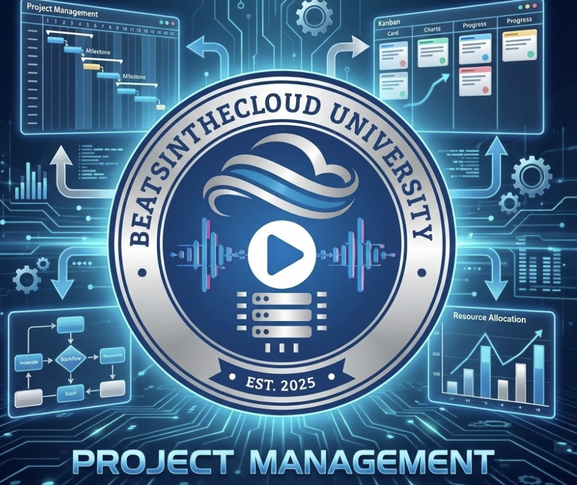

  

# Track: Project Management

**Focus:** Agile, Scrum, Product Leadership  
**Est. Cost:** $192  
**Time to Complete:** ~6-9 Months

**Target Degree:** B.A. in Liberal Arts, Specialization in Business Administration

**Why:** This track is 100% aligned with the Business Administration major. Every single core course and elective is a standard business school requirement.

---

## Specialty Core (30 Credits)

*Strategy: Cheapest track. Uses Google PM cert + Business Ops credits.*

| Course / Certification | Provider | Est. Cost | Credits | Role |
|------------------------|----------|-----------|---------|------|
| Google Project Management | Google (Coursera) | ~$147 | 10 | **Cert #1:** Agile, Waterfall, Scrum |
| BUS402: Project Management | Saylor | $5 | 3 | Methodologies (Theory) |
| BUS300: Operations Mgmt | Saylor | $5 | 3 | Supply chain/Process |
| Principles of Management | Modern States | $0 | 3 | Leadership |
| BUS209: Org Behavior | Saylor | $5 | 3 | Team dynamics |
| Intro to Business Law | Modern States | $0 | 3 | Contracts & SOWs |
| Financial Accounting | Modern States | $0 | 3 | Budgeting & Costing |
| BUS206: Mgmt Info Systems | Saylor | $5 | 3 | Tools (Jira/Asana) |

---

## Electives (15 Credits)

| Course Name | Provider | Cost | Credits | Relevance |
|-------------|----------|------|---------|-----------|
| Real-World Product Mgmt | Coursera | Incl. | 6 | **Cert #2:** Product Focus |
| BUS210: Business Comm | Saylor | $5 | 3 | Stakeholder reporting |
| BUS303: Strategic IT | Saylor | $5 | 3 | Business Alignment |
| BUS200: Business Ethics | Saylor | $5 | 3 | Governance |

---

## 9-Month Roadmap

| Month | Focus |
|-------|-------|
| Month 1-3 | Google Project Management (Coursera) |
| Month 4 | BUS402 Project Mgmt (Saylor) |
| Month 5 | Operations Management |
| Month 6 | Org Behavior & Leadership |
| Month 7 | Business Law (CLEP) |
| Month 8 | Financial Accounting (CLEP) |
| Month 9 | Electives |

---

[← Back to All Tracks](../README.md#the-tracks)
