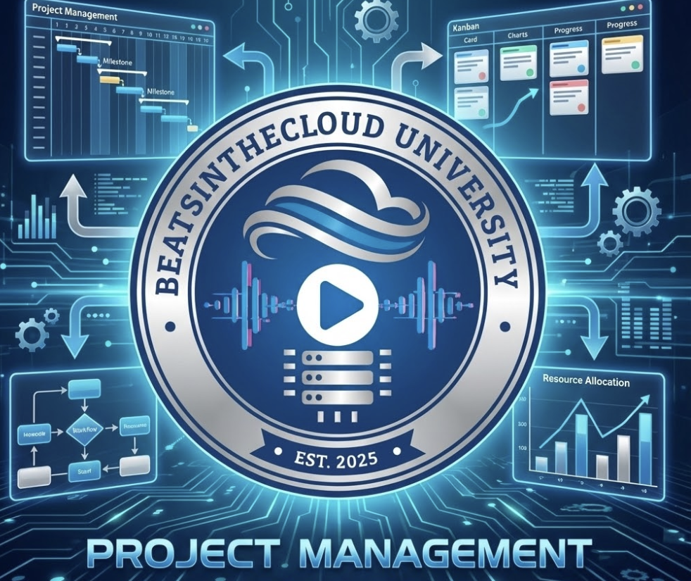

  

# Track: Project Management

**Focus:** Agile, Scrum, Product Leadership  
**Est. Cost:** $192  
**Time to Complete:** ~6-9 Months

**Target Degree:** B.A. in Liberal Arts, Specialization in Business Administration

**Why:** This track is 100% aligned with the Business Administration major. Every single core course and elective is a standard business school requirement.

---

## Specialty Core (31 Credits)

*Strategy: Cheapest track. Uses Google PM cert + Business Ops credits.*

| Course / Certification | Provider | Est. Cost | Credits | Role |
|------------------------|----------|-----------|---------|------|
| Google Project Management | Google (Coursera) | ~$147 | 10 | **Cert #1:** Agile, Waterfall, Scrum |
| BUS402: Project Management | Saylor | $5 | 3 | Methodologies (Theory) |
| BUS300: Operations Mgmt | Saylor | $5 | 3 | Supply chain/Process |
| Principles of Management | Modern States | $0 | 3 | Leadership |
| BUS209: Org Behavior | Saylor | $5 | 3 | Team dynamics |
| Intro to Business Law | Modern States | $0 | 3 | Contracts & SOWs |
| Financial Accounting | Modern States | $0 | 3 | Budgeting & Costing |
| BUS206: Mgmt Info Systems | Saylor | $5 | 3 | Tools (Jira/Asana) |

---

## Recommended Electives (15 Credits)

| Course Name | Provider | Cost | Credits | Relevance |
|-------------|----------|------|---------|-----------|
| Real-World Product Mgmt | Coursera | Incl. | 6 | **Cert #2:** Product Focus |
| BUS210: Business Comm | Saylor | $5 | 3 | Stakeholder reporting |
| BUS303: Strategic IT | Saylor | $5 | 3 | Business Alignment |
| BUS200: Business Ethics | Saylor | $5 | 3 | Governance |

---

# Capstone Certification

> **Note:** Capstone certifications are **not ACE credit eligible** and do not transfer as college credit. They are included as career-focused credentials that **build your "Shield"**—backing up your academic credentials with industry-recognized proof of technical competence that employers trust.

### Recommended Capstone: PMI CAPM

| | |
|---|---|
| **Provider** | Project Management Institute |
| **Cost** | $225 (PMI member) / $300 (non-member) |
| **ACE Credit** | ❌ Not Eligible |

**Why this certification?**

The PMI Certified Associate in Project Management (CAPM) is respected across corporate and enterprise environments. Your Google Project Management Certificate satisfies the 23-hour training requirement entirely—it actually provides 100 hours of PMI-approved training, so there's no additional training cost. This PMI credential validates your PMBOK knowledge and signals to employers that you're serious about project management as a career. **This is your Shield**—PMI-backed validation of your project management fundamentals.

### Recommended Association

| | |
|---|---|
| **Organization** | PMI (Project Management Institute) |
| **Cost** | $164 first year ($154 renewal + $10 application fee) |
| **Website** | [pmi.org/membership](https://www.pmi.org/membership) |

**Why join?** The gold standard PM association. Reduces CAPM exam cost by $75. Access to PMBOK guide, local chapters, job boards, and PDU opportunities. If you're pursuing CAPM, membership pays for itself immediately.

---

# Go Further. Pursue a Masters Degree at a fraction of the cost of traditional school. Save more money and time if you can speak spanish

## Project Management Track

| School | Program | Target Cost | High End Cost | Accreditation | NACES Eval? | Note |
|--------|---------|-------------|---------------|---------------|-------------|------|
| ENEB/Universidad Isabel I | MBA + Master in Project Management | $300 | $600 | Universidad Isabel I (Spain) - Titulo Propio, ECTS credits | Yes - ECE or WES as Graduate Credits | Includes innovation & PM specialization; evaluated as graduate credits (not Master's equivalent) |
| ENEB/Universidad Isabel I | MBA + Master in Human Resources and Talent Management | $300 | $600 | Universidad Isabel I (Spain) - Titulo Propio, ECTS credits | Yes - ECE or WES as Graduate Credits | Leadership & org development; evaluated as graduate credits (not Master's equivalent) |
| Hellenic American University | MBA (Remote) | $3,500 | $3,500 | NECHE (US Regional) - New Hampshire | No - US Regionally Accredited | Affordable US-accredited MBA; rolling cohorts |
| Western Governors University | MS in IT Management | $4,080 | $8,160 | NWCCU (US Regional) | No - US Regionally Accredited | 67% finish in 19 months; includes CAPM prep |
| Elmwood Institute | MS in Leadership & Management | $900 | $900 | DEAC (US National) | No - NA accreditation | Ultra low-cost; 36 credits at $25/credit; accepts 50% transfer |
| Signum Magnum College | Executive MBA | €2,000 | €5,000 | MFHEA (Malta/EU) - EQF Level 7 | Yes - EU credential | 90 ECTS; live online lectures; flexible tuition |
| UNISA SBL | [Master of Business Administration (90070)](https://www.unisa.ac.za/sites/corporate/default/Apply-for-admission/Master's-&-doctoral-degrees/Qualifications/All-qualifications/Master-of-Business-Administration-(90070)) | ~$4,000 | ~$4,000 | South African Public University - Coursework + Dissertation | Yes - WES or ECE | Online via Graduate School of Business Leadership; 3 years work experience required |

### Notes

**ENEB Programs:** Offered via Universidad Isabel I as Titulo Propio degrees. These are evaluated by NACES members (WES, ECE) as graduate credits rather than full Master's equivalents. Very affordable dual-degree option.

**U.S. Regionally Accredited (Hellenic American University, WGU):** No NACES evaluation needed for U.S. employers. Fully recognized for government jobs and most employers. Hellenic American University offers traditional cohort-based MBA, while WGU offers competency-based education (CBE) for faster completion.

**Elmwood Institute:** DEAC (Distance Education Accrediting Commission) is U.S. national accreditation, not regional. While legitimate, some employers may prefer regional accreditation. Extremely low cost at $25/credit.

**Signum Magnum College:** Malta-based EU accreditation (EQF Level 7). May require NACES evaluation for U.S. roles. Recognized across EU and internationally.

**UNISA SBL:** South African institution offering MBA through Graduate School of Business Leadership. Requires 3 years of work experience for admission. Online distance learning format with both coursework and dissertation components. Higher cost than other UNISA programs but still competitive internationally.

---

[← Back to All Tracks](../README.md#the-tracks)
