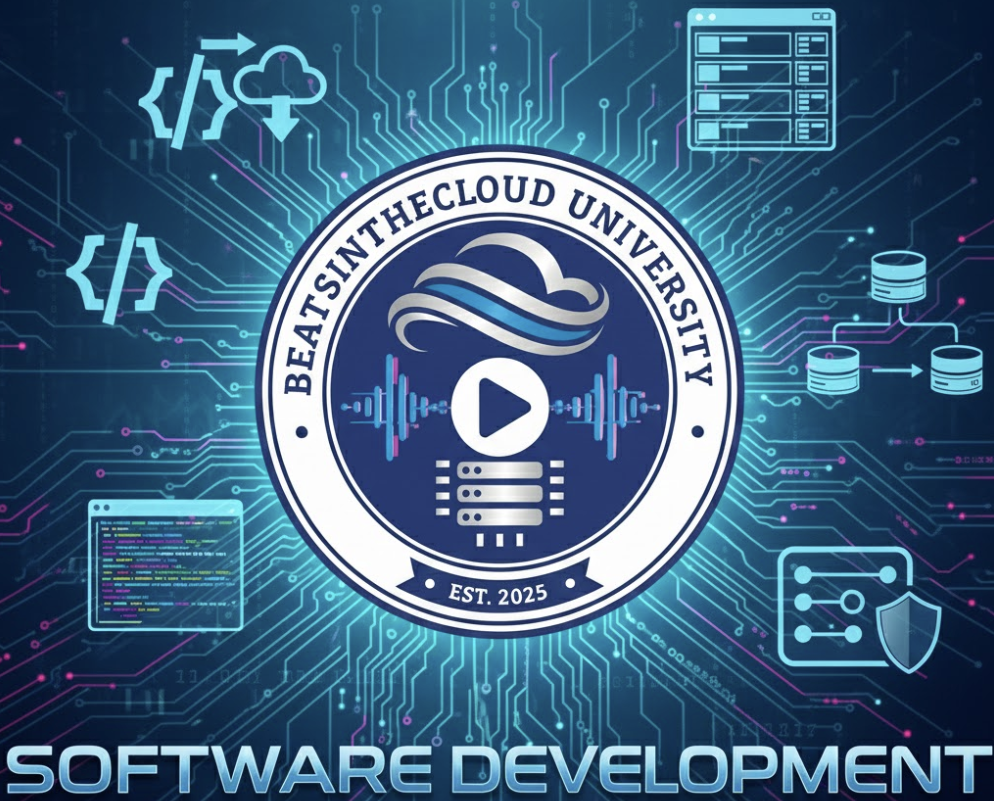

  

# Track: Software Development

**Focus:** Full Stack (Frontend + Backend), Web Engineering  
**Est. Cost:** $265  
**Time to Complete:** ~9 Months

**Target Degree:** B.A. in Liberal Arts

**Why:** Like the AI track, this is a pure technical play. The high volume of coding credits (28 credits from Coursera) fits best in the flexible General Liberal Arts program, avoiding the need for "Business Core" credits that would slow you down.

---

## Specialty Core (30 Credits)

*Strategy: 28 Credits from Coursera alone. High velocity track.*

| Course / Certification | Provider | Est. Cost | Credits | Role |
|------------------------|----------|-----------|---------|------|
| Meta Front-End Developer | Meta (Coursera) | ~$98 | 10 | **Cert #1:** React, UI/UX, JS |
| IBM Full Stack Developer | IBM (Coursera) | ~$147 | 18 | **Cert #2:** Cloud Native, Node.js, Python |
| CS302: Software Engineering | Saylor | $5 | 3 | SDLC & Architecture |
| MA120: Applied Algebra | Saylor | $5 | 3 | Logic Foundation |

---

## Electives (15 Credits)

| Course Name | Provider | Cost | Credits | Relevance |
|-------------|----------|------|---------|-----------|
| Calculus | Modern States | $0 | 3 | Algorithms |
| Information Systems | Modern States | $0 | 3 | Tech Stack context |
| BUS402: Project Management | Saylor | $5 | 3 | Agile/Scrum |
| BUS300: Operations Mgmt | Saylor | $5 | 3 | CI/CD Ops |
| PHIL102: Logic | Saylor | $5 | 3 | Boolean logic |

---

## 9-Month Roadmap

| Month | Focus |
|-------|-------|
| Month 1-2 | Meta Front-End Cert (Coursera) |
| Month 3-5 | IBM Full Stack Cert (Coursera) |
| Month 6 | Software Engineering (Saylor) |
| Month 7 | Applied Algebra |
| Month 8 | Calculus (CLEP) |
| Month 9 | Project Management & Ops |

---

[← Back to All Tracks](../README.md#the-tracks)
